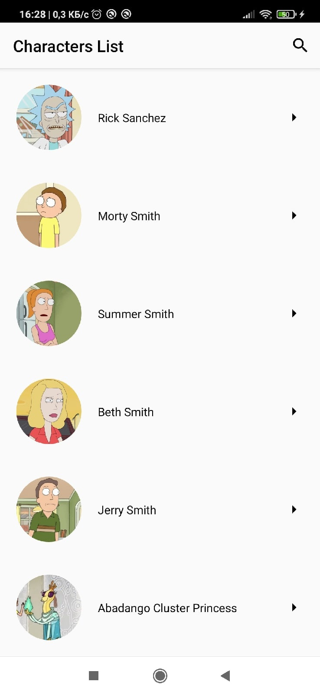

# Курсовой проект

**Гайд по "Рик и Морти"**

### Стек
* ЯП: Kotlin
* Архитектура: Clean Architecture + MVVM
* Асинхронность: Coroutines + Flow
* Навигация: Navigation Component
* Внедрение зависимостей: Dagger2
* Работа с сетью: Retrofit
* Работа с базой данных: Room

### Работа приложения

Список персонажей | Детали
:-------------------:|:------------:
 | 

	

